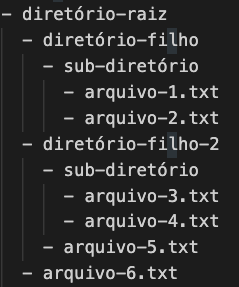

# Linha de comando (básico)

A linha de comando permite que um usuário navegue no sistema de arquivos de um computador e execute programas internos ou scripts personalizados. No Unix, a interface da linha de comandos é chamada de Bash, e o prompt do shell é o cifrão (`$`).

> **Observação:** Se você utiliza o sistema operacional Windows, será necessário usar o PowerShell para acompanhar os comandos demonstrados abaixo, visto que eles são específicos de sistemas baseados em Unix, tais como Linux e OSX.

## Estrutura do sistema de arquivos

  
O sistema de arquivos de um computador ...

     ... organiza os dados armazenados no computador para que possam ser facilmente recuperados pelo usuário. Os arquivos são normalmente representados por uma estrutura semelhante a uma árvore, na qual um diretório pai pode ter vários diretórios filhos. O diretório raiz é encontrado na base da árvore. 

  
Clique para ver um exemplo
 

  

## Comandos

### Listar (`ls`)

  
O comando shell `ls` ...

     ... é usado para listar o conteúdo dos diretórios. Se nenhum argumento é fornecido, ele listará o conteúdo do diretório de trabalho atual.

### Opções do comando `ls`

  
O comando shell `ls` pode ser combinado com as seguintes opções:

     1. `ls -a` - lista todo o conteúdo do diretório, incluindo arquivos e diretórios escondidos, ou seja, aqueles que começam com um ponto (.) 
    2. `ls -l` - lista o conteúdo do diretório com informações adicionais, tais como permissões de execução, leitura e escrita, usuário, grupo, etc. 
    3. `ls -t` - lista o conteúdo do diretório por horário modificado (modificado pela última vez primeiro) 
    > Além disso, é possível combinar opções, tal como `ls -alt`.

### Imprimir o diretório de trabalho (`pwd`)

  
O comando shell `pwd` ...

     ... exibe o caminho do diretório de trabalho atual.

### Alterar diretório (`cd`)

  
O comando shell `cd` ...

     ... pode ser usado para se mover pelo sistema de arquivos do computador. Ele aceita uma variedade de argumentos, tais como: 
    1. o caminho completo de um determinado diretório 
    2. diretórios filhos do diretório atual 
    3. `..` para voltar ao diretório pai do diretório atual.

### Criar diretório (`mkdir`)

  
O comando shell `mkdir` ...

     ... pode ser usado para criar um novo diretório no sistema de arquivos de acordo com seu argumento. Se um caminho for fornecido, o novo diretório será colocado no final, caso contrário, ele criará um novo diretório no diretório de trabalho atual com o nome fornecido.

### Criar novo arquivo (`touch`)

  
O comando shell `touch` ...

     ... cria um novo arquivo no diretório de trabalho atual com o nome fornecido.

### Copiar (`cp`)

  
O comando shell `cp` ...

     ... é usado para copiar arquivos e diretórios. Sua estrutura básica é `cp fonte destino`, onde `fonte` é o diretório ou arquivo a ser copiado para o arquivo ou diretório `destino`.

### Mover (`mv`)

  
O comando shell `mv` ...

     ... é usado para mover um arquivo para um diretório. Ao utilizar o comando `mv` a primeira opção passada ao comando é o arquivo o qual deseja-se mover e a segunda opção é o diretório para onde queremos o mover (ex.: `mv arquivo.txt diretório-destino/`).

### Remover (`rm`)

  
O comando shell `rm` ...

     ... é usado para deletar arquivos e diretórios. É possível passar a opção `-r` para deletar um diretório com todos seus arquivos e sub-diretórios.

### Manual (`man`)

  
O comando shell `man` ...

     ... pode ser utilizado passando como opção outro comando qualquer (ex.: `man ls` ou `man mkdir`), para imprimir o manual completo de tal comando.

___

Feito com ❤️ por [Walmyr](https://walmyrfilho.com).
